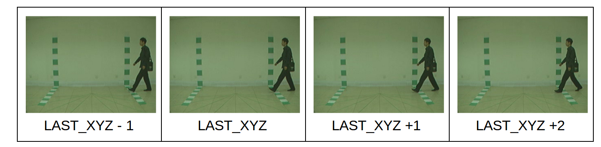

## AVAMVG dataset migration
The AVAMVG has a different folder structure than the one used in the CASIA. Migration will copy this file from a source folder with the struture:
	
    AVAMVG
    └── A
      ├── tr01_cam00
      │   ├── 000000.png
      │   ├── 000001.png
      │   ├── 000002.png....
    └── B
      ├── tr01_cam00
      │   ├── 000000.png
      │   ├── 000001.png
      │   ├── 000002.png...
    
The output will be something like this:
```
AVAMVG/
├── DatasetB
│   ├── A
│   │   └── tr-01
│   │       ├── tr-01-000
│   │       │   ├── A-tr-01-000_frame_000000.png
│   │       │   ├── A-tr-01-000_frame_000001.png
│   │       │   ├── A-tr-01-000_frame_000002.png
```
### run migration
First configure the lines 16 and 23 from the file `src/run_avamvg_migration`. The source folder and the destination
should have the structure that is mentioned above. Run the command:
```commandline
source activate multiviewer # just one is needed
python src/run_avamvg_migration.py
```
Alternatively, we can run in the command line
```commandline
source activate multiviewer # just one is needed
python src/run_avamvg_migration.py --avamvg-dir [path to person folder] --dest-dir [path to output]
```
The avamvg directory should be the folder containing the persons in the original folder strucrue that is  `A,B,...`.
The destination directory will also be ordered by person that is `A,B,...`, but with the offical folder structure.
## AVAMVG multiviewer
The AVGMVG multiviewer is aimed to make annotations in the AVAMVG dataset. this works the same as run_multiviewer5.py. 
```commandline
python src/run_multiviewer_avamvg.py --p-num A --subsequence tr-01
```
Edit the `run_multiviewr_avamvg.py` to the same way as the `run_multiviewer5`.
The avamvg define a folder named 'inout_path' that stores the first frame (IN_FRAME, IN) and last in frame 
(OUT OF FRAME, OUT). This information is stored in a files with the name `[person]'-[subsequence]-inout.json`.
The content of this file for INs at [1,2,3,4,5,6] and outs at [11,12,13,14,15] will be:
```json
  {    
     in0: 1,
     in1: 2,
     in2: 3,
     in3: 4, 
     in4: 5,
     in5: 6,
     out0: 11, 
     out1: 12, 
     out2: 13, 
     out3: 14, 
     out4: 15, 
     out5: 16
    }
``` 
## multichecker
The multichecker allows to visualize the transitions:
+ LAST_ON_AIR
+ LAST_ON_GROUND
+ LAST_NOT_IN_FRAME

The transitions shown are one frame before the “LAST_XYZ” and two frames after. So we have the transition in the middle.



The multicheck expect to main inputs
+ the images path for example ./images_path.
+ the annotations path for example ./annotations_path
+ the person code example 001
+ the sub-sequence example bg-01

The images path should have the following folder structure.
```commandline
images_path
    └── 001
        └── bg-01
            ├── bg-01-000
            │   ├── flame_frame_000.jpg
            │   ├── flame_frame_001.jpg
            │   └── flame_frame_002.jpg
            ├── bg-01-018
            (...)
```
the annotations path contains the csv annotations files. The expected input is follows: 
```commandline
./annotations_path
└── 001
    └── bg-01
        ├── bg-01-018-left.csv
        ├── bg-01-018-right.csv
        ├── bg-01-054-left.csv
        ├── bg-01-054-right.csv
        ├── bg-01-090-left.csv
        ├── bg-01-090-right.csv
        ├── bg-01-126-left.csv
        ├── bg-01-126-right.csv
        ├── bg-01-162-left.csv
        └── bg-01-162-right.csv
```
### Run multichecker
Run the multichecker with the following command
```commandline
source activate multiviewer # this is only needed to do once
python src/run_multicheck.py --p-num 001 --subsequence bg-01
```

edit the text indicated in the script to modify the images path and the annotations path,